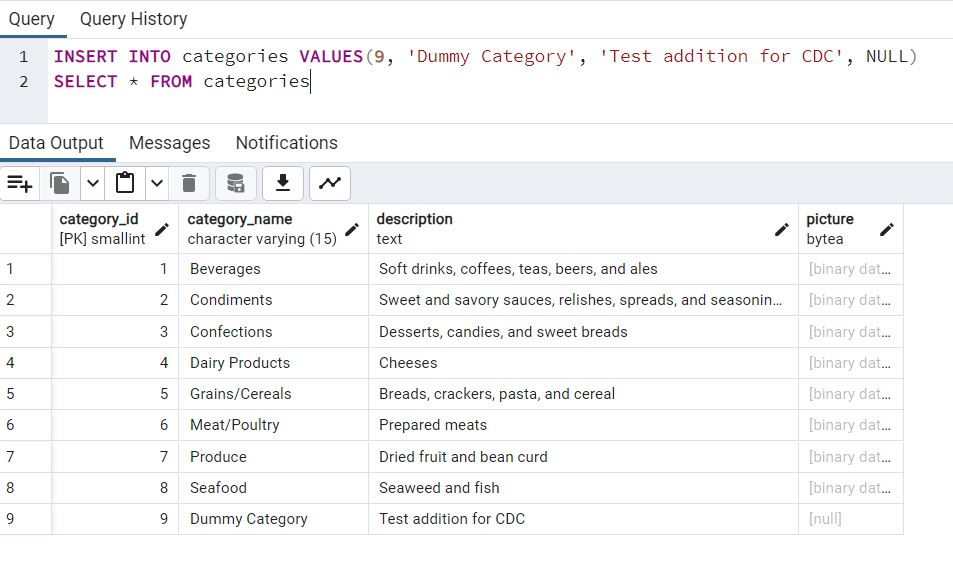

# Northwind ELT Pipeline
Capstone Project for Data Engineering Camp

# Overview
The source database is an OLTP system running on PostgreSQL hosted on AWS RDS. I chose the Northwind database as the source system for its ease of use and practical components. Northwind contains data related to orders, products, suppliers, customers and employees. The database provides a realistic structure for the data that would be generated as part of the operations of a consumer products company.

The Northwind GitHub provides SQL scripts and instructions for populating a Postgres database. This database allows for immediate use without the need for custom or extensive extraction code. It was ideal for me to use a well-established dataset to focus on the other components of the ELT process and the various tools used in the Data Engineer Camp.

Source of the data and usage instructions can be found here: https://github.com/pthom/northwind_psql

# Project Components


## 1. Destination Data Warehouse: Snowflake (OLAP)
Snowflake is the destination data warehouse where the extracted data from the Northwind database will be loaded. Snowflake contains several schemas that support various parts of analysis process, and can be further customized and expanded to address many types of business questions. 

## 2. Data Extraction Tool: Airbyte
Data extraction was accomplished using Airbyte. I used Airbyte hosted in an AWS EC2 instance to extract data from the source database and load it into the raw schema within the Snowflake data warehouse.

## 3. Data Transformation Tool: dbt
For data transformations and dimensional data modelling, I used DBT (Data Build Tool). DBT was used to setup the Staging, Marts and Reports schemas within my data warehouse. This process involved loading raw data from Postgres into Snowflake, transforming it, and loading it into the relevant schemas. DBT was used in the staging layer to remove unnecessary columns, create new columns, and test incoming data. DBT was used in the Marts layer to create tables based on my Entity Relationship (ER) diagram and a custom Periodic snapshot report. The Reports schema holds a single One Big Table report. Several out-of-the-box and custom data quality tests are used throughout the schemas to ensure data integrity. 

## 4. Orchestrator: dagster
Dagster is used to manage the airbyte and dbt assets. Dagster allow for defining an asset, creating a global DAG of asset dependencies, and creating policies to materialize assets.

## 5. BI Tool: Tableau
Tableau is the BI tool I used to create visualizations and analysis of our transformed data. This project used Tableau Cloud. 

## 6. CI/CD (In process)


# Project Workflow
**1. Extraction (E):** Airbyte connects to the PostgreSQL database and leverages the enabled Change Data Capture (CDC) functionality to extract data efficiently. CDC ensures that only the changed or updated data since the last extraction is captured. CDC also allows for the capture of hard deletes from source data.

**2. Loading (L):** Airbyte loads the extracted data into Snowflake using the appropriate Snowflake connector. The data is loaded into a raw schema.

**3. Transformation (T):** Transformation tasks, if necessary, can be performed with downstream processes such as DBT running against Snowflake. These tasks are responsible for creating the staging, marts, and reports schemas.

# Implementation Steps

## Set up Source Database:
- Create a PostgreSQL database in AWS RDS.
- Connect to the database using a management tool for PostgreSQL and restore the Northwind database, using provided SQL script. 
- The PostgreSQL database in AWS RDS was customized to allow for Change Data Capture (CDC). See setup folder in GitHub repo for more information SQL script and implementation notes. 

## Deploy Airbyte on AWS EC2:
- Launch an EC2 instance on AWS.
- Use AWS built-in functionality to connect to hosted instance and install Airbyte.
- Setup Airybte sources for Postgres database and Snowflake and connection between the two.
- (Recommended) Access Airbyte securely via SSH tunneling.

## Set up Airbyte:
- The initial trigger for Airbyte's connection to the PostgreSQL database was facilitated by enabling Change Data Capture (CDC) within the source system.
- Airbyte utilizes the CDC functionality to track changes in the source database, ensuring that only incremental data is extracted during each extraction cycle.
- The extracted data is then loaded into Snowflake for further processing and analysis.


## Transform the Data:
- Install dbt and the dbt plugin for Snowflake using the following commands in the terminal (bash):
 ```bash
    pip install dbt-core==1.7.0

    pip install dbt-snowflake==1.7.0
```
- Run `dbt init` in the Command Line Interface (CLI) to initialize DBT and start a new project.
- Provide the project's name, creating a dedicated folder within the directory where DBT was initialized.
- The models folder within this directory is where transformations are defined.
- Each folder in the models folder represents a schema within the database, with each file within these folders representing a model for a table in the schema.
- Define the transformations for each model using DBT's Snowflake SQL syntax.

## Orchestrate Workflow:
- Create a new virtual environment that uses 3.11 version of python. 
 ```bash
    conda create -n dagster python=3.11
    conda activate dagster
```
- Install dagster
 ```bash
    pip install dagster==1.6.8
```

- Bootstrap a new project/scaffold new dagster project:
 ```bash
dagster project scaffold --name analytics
 ```
- Install other dependencies required for this dagster project and run.
 ```bash
cd dagster
pip install -e ".[dev]"
Run dagster
dagster dev
 ```

- Customize project to add both Airbyte and dbt assets


- Schedule ELT pipeline on the cloud (dagster – In process):


# CDC Functionality Screenshots
Here are some screenshots that demonstrate the CDC functionality working inside Airbyte:
## 1. Insert Functionality:


## 2. Update Functionality:


## 3. Delete Functionality:


# Database ER Diagrams
## Northwind ER Diagram 


## Dimensional Model ERD


# Visualization


# Conclusion/Lessons Learned 
